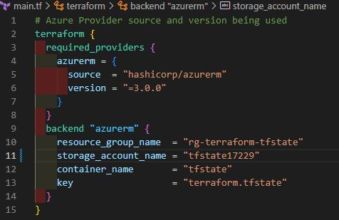

# Terraform-Proficiency-Bronze-jmarcial
Doing the Bronze badge for [3Cloud Terraform Proficiency](https://www.3clouduniversity.com/Badges/View/104).

# Getting Started
You will need an Azure subscription and a storage account to use for the backend storage.
1. Create a Storage Account and Blob Container to store the terraform state
   - Run the `backend.sh` script, this will deploy the resource group, storage account, and container in Azure
   - Take note of the output for the next step
   
     

2. In the Terraform main script, update the Backend Block
   - Input the values from the output above except the ***access_key*** (optional)
   - `terraform.tfstate` is the Blob that stores the remote state file. This will be the **key** value
   
     


3. Running Terraform
   - Initialize
     ```
     Terraform init
     ```
   - Run the `plan` command
     ```
     Terraform plan
     ```
   - If you are satisfied, run the `apply` command
     ```
     Terraform apply -auto-approve
     ```
   - Verify by accessing your Azure portal
   - When you are done, remove the resources with the `destroy` command
     ```
     Terraform destroy -auto-approve
     ```
